# Multi-Tenant SaaS Gateway Architecture

Architectural overview of the Multi-Tenant SaaS Service, designed to provide strong data isolation between B2B SaaS tenants while maintaining a single, scalable database schema.

## 1. System Context

The SaaS Service acts as the primary API Gateway for tenant resources. It is responsible for:
- Validating incoming OAuth2 JWTs via Keycloak/Auth0.
- Extracting the `tenant_id` claim.
- Enforcing global rate limits using Redis.
- Proxying requests to the PostgreSQL database under strict Row-Level Security (RLS) constraints.

## 2. Row-Level Security (RLS) Pattern

Traditional multi-tenancy either uses separate databases per tenant (too expensive) or separate schemas (hard to migrate). This project uses a **Shared Database, Shared Schema** approach secured by **PostgreSQL Row-Level Security**.

### RLS Flow Diagram

```mermaid
sequenceDiagram
    participant Client
    participant API Gateway (Spring Boot)
    participant Redis (Rate Limiter)
    participant TenantContext (ThreadLocal)
    participant Hibernate (MultiTenantConnectionProvider)
    participant HikariCP (Connection Pool)
    participant PostgreSQL (RLS Enabled)

    Client->>API Gateway (Spring Boot): GET /api/v1/products + JWT(tenant_id=A)
    
    rect rgb(40, 40, 40)
        Note over API Gateway (Spring Boot),Redis (Rate Limiter): 1. Security & Throttling
        API Gateway (Spring Boot)->>API Gateway (Spring Boot): Validate JWT Signature
        API Gateway (Spring Boot)->>Redis (Rate Limiter): Lua Script (tenant_A, limit=100)
        Redis (Rate Limiter)-->>API Gateway (Spring Boot): Allowed
    end

    API Gateway (Spring Boot)->>TenantContext (ThreadLocal): setTenantId("A")
    
    rect rgb(40, 60, 40)
        Note over API Gateway (Spring Boot),PostgreSQL (RLS Enabled): 2. Data Access & Isolation
        API Gateway (Spring Boot)->>Hibernate (MultiTenantConnectionProvider): Request Connection
        Hibernate (MultiTenantConnectionProvider)->>HikariCP (Connection Pool): getConnection()
        HikariCP (Connection Pool)-->>Hibernate (MultiTenantConnectionProvider): Sterile JDBC Connection
        Hibernate (MultiTenantConnectionProvider)->>PostgreSQL (RLS Enabled): SELECT set_config('app.current_tenant', 'A', false)
        API Gateway (Spring Boot)->>PostgreSQL (RLS Enabled): SELECT * FROM products
        Note over PostgreSQL (RLS Enabled): Postgres evaluates RLS Policy:<br/>USING (tenant_id = current_setting('app.current_tenant'))
        PostgreSQL (RLS Enabled)-->>API Gateway (Spring Boot): Returns ONLY Tenant A rows
    end

    Hibernate (MultiTenantConnectionProvider)->>PostgreSQL (RLS Enabled): RESET app.current_tenant
    Hibernate (MultiTenantConnectionProvider)->>HikariCP (Connection Pool): returnConnection()
    API Gateway (Spring Boot)->>TenantContext (ThreadLocal): clear()
    API Gateway (Spring Boot)-->>Client: 200 OK (Products)
```

### Defense-in-Depth

The beauty of this architecture is that the application layer (Java) does **not** append `WHERE tenant_id = ?` to queries. 
If a developer writes a query like `SELECT * FROM products`, the database interceptor automatically applies the RLS policy. Data leakage is prevented at the database engine layer, providing a secondary trust boundary.

## 3. Distributed Rate Limiting

To protect against noisy neighbors in a multi-tenant environment, a global token-bucket rate limiter is implemented using **Redis Lua Scripts**. 
Unlike local `Resilience4j` limiters which only track rates per Kubernetes Pod, the Redis implementation guarantees an absolute global limit across the entire microservice cluster.

## 4. Key Technologies
- **Java 21 & Spring Boot 3.4**: Core framework.
- **Spring Security OAuth2**: For JWT validation and Claim extraction.
- **PostgreSQL 16**: For persistence and RLS.
- **Redis & Lua**: For atomic, distributed rate limiting.
- **Testcontainers**: For isolated, high-concurrency CI/CD integration testing using real PostgreSQL containers.

## 5. Architectural Decision Records (ADRs)

### ADR-001: Native Hibernate Multi-Tenancy over JDBC Proxying
**Context:** Our PostgreSQL Row-Level Security strategy requires `SET SESSION app.current_tenant` to be executed on the physical database connection before queries are run, and `RESET app.current_tenant` to be executed before returning the connection to the HikariCP pool.
**Decision:** We exclusively use Hibernate 6's native `MultiTenantConnectionProvider` and `CurrentTenantIdentifierResolver` instead of wrapping the `DataSource` in a dynamic `java.lang.reflect.Proxy`.
**Consequences:**
- **Zero GC Overhead:** We eliminate the reflection overhead of intercepting every single JDBC method invocation, which dramatically reduces Garbage Collection pressure at high throughput.
- **Sterile Connection Management:** By strictly controlling the `releaseConnection` phase, if a `RESET` command fails (e.g. due to a network blip), we explicitly call `connection.abort()`. This prevents HikariCP from recycling a potentially tainted connection, effectively eliminating the risk of cross-tenant data bleed during transient infrastructure failures.
